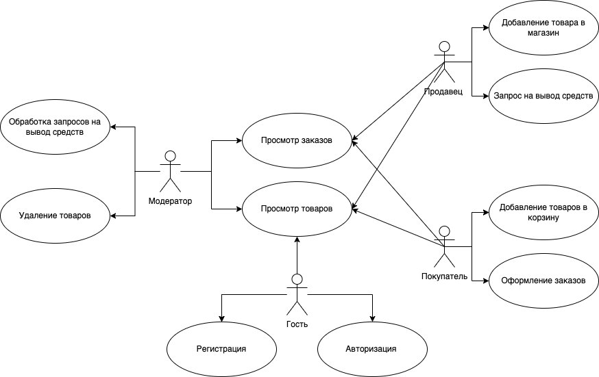
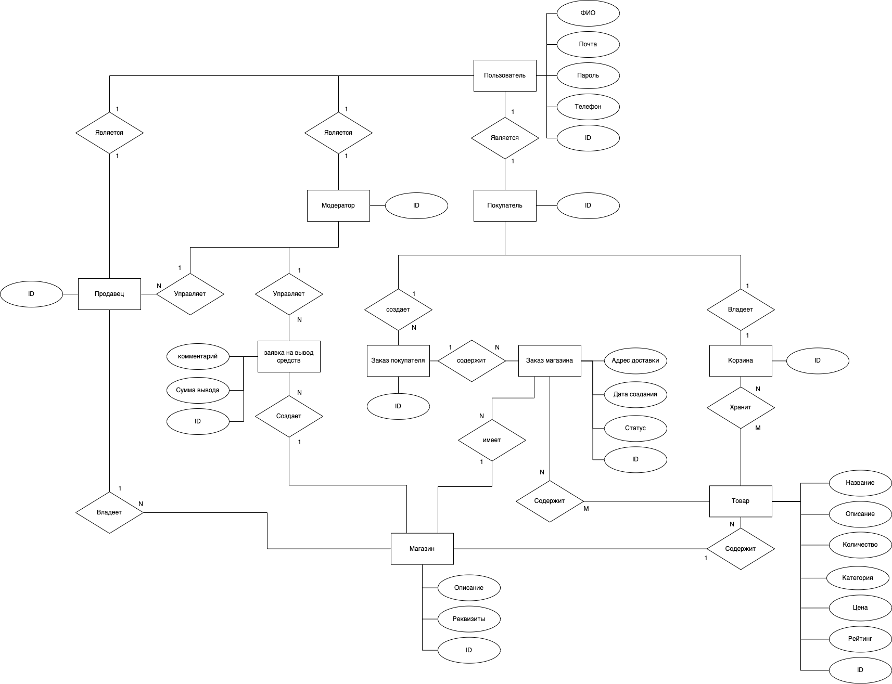
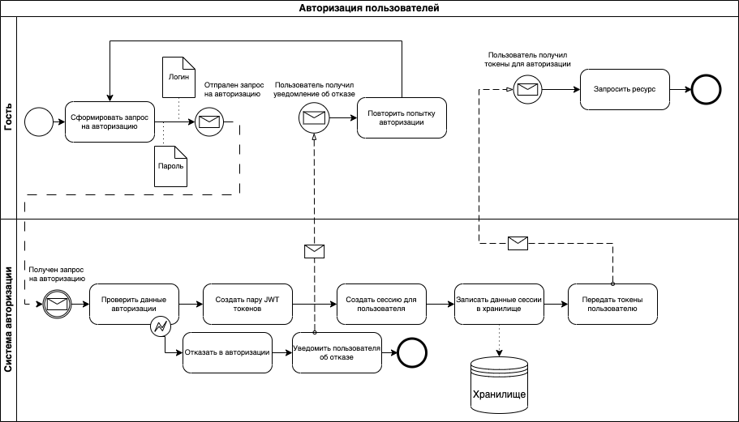

# ППО

## Название проекта

GigaMarket

## Краткое описание идеи проекта

Электронная торговая площадка для онлайн продажи и покупки товаров,
предоставляющая возможность пользователям заказывать товары онлайн и размещать объявления для продажи собсвенной продукции.

## Краткое описание предметной области

Предметная область - торговая площадка.

Продавцы могут размещать свои товары для продажи, а покупатели могут выбирать и приобретать их онлайн. 
Это удобный способ для крупных и малых компаний продавать свою продукцию без необходимости открывать собственный интернет-магазин. 
Пользователи могут проводить сделки, сравнивать цены и выбирать лучшие предложения на рынке.

## Краткий анализ аналогичных решений по 4 критериям

|Решение|Выбор продуктов и категорий|Отзывы| Доступность оплаты в России |Низкий порог входа для продажи товаров|
|---|---|---|-----------------------------|---|
|Ozon|+|+| +                           |-|
|Amazon|+|+| -                           |-|
|Wildberries|+|+| +                           |-|
|GigaMarket|+|+| +                           |+|

## Актуальность

Электронные торговые площадки предоставляют товары от различных продавцов, что способствует конкуренции и в итоге может привести к более выгодным ценам для покупателей.
Покупатели могут совершать покупки в любое время суток, не выходя из дома или офиса, что экономит время и упрощает процесс покупки.

## Описание ролей
**Гость** - неавторизованный пользователь.

**Покупатель** - имеет возможность оформлять заказы.

**Продавец** - имеет возможность выставлять товары на продажу.

**Модератор** - занимается мониторитом контента на площадке и взаимодейстует с пользователями.

## Use-Case диаграмма

## ER диаграмма

## Сложные сценарии

#### Оформление заказа
1. Пользователь в корзине нажимает кнопку оплатить;
2. Генерируется ссылка для оплаты с параметрами идентификации пользователя, на которую он перенаправляется;
3. Пользователь вводит платежные данные и подтверждает оплату;
4. Сервис получает уведомление от платежной системы об оплате корзины определенным пользователем;
5. Товары в корзине распределяются по заказам для каждого магазина;
6. Отправляется уведомление о новом заказе для каждого магазина по email;
7. Пользователь возвращается на страницу завершения оплаты.

#### Авторизация пользователей
1. Пользователь при входе вводит логин и пароль;
2. Создается пара JWT токенов - access токен и refresh токен;
3. Создается новая сессия;
4. Сессия помещается в хранилище;
5. Пользователю возвращется пара JWT токенов.

## Пользовательские сценарии

**Гость** может:
- просмотреть товары;
- авторизоваться (ввести логин и пароль учетной записи);
- зарегистрироваться (создать учетную запись).

После авторизации гость становится *покупателем* или *продавцом*.

**Покупатель** может:
- просмотреть товары;
- добавить товар в корзину;
- офромить заказы;
- просмотреть заказы.

**Продавец** может:
- просмотреть товары;
- просмотреть заказы;
- добавить товар в магазин;
- оформить запрос на вывод средств.

**Модератор** может:
- просмотреть товары;
- просмотреть заказы;
- удалить товары;
- обработка запросов на вывод средств.

## BPMN-диаграмма

## Описание технологического стека
- Язык - Golang
- Тип UI - Web SPA (фреймворк React с TypeScript)
- Тип приложения - Web API
- База данных - PostreSQL
- Хранилище сессий - Redis
- Платежная система - YooMoney
- Email Provider - golang net/smtp
- Аутентификация - JWT токены

## Верхнеуровневое разбиение на компоненты

## UML диаграммы классов

## Диаграмма компонентов

## UML диаграммы классов

